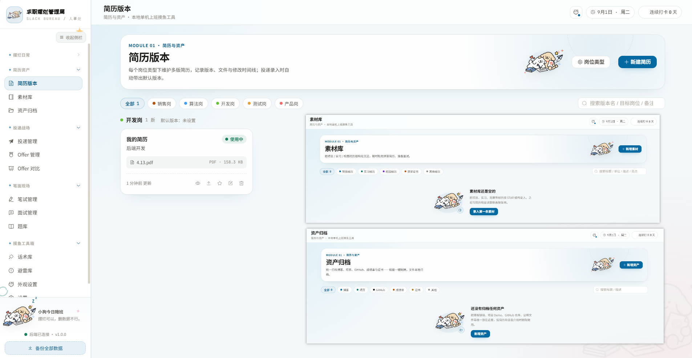
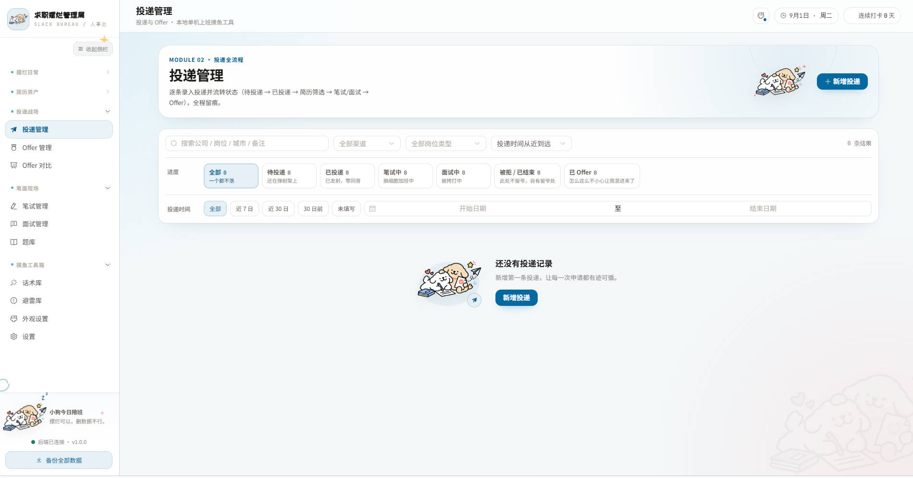
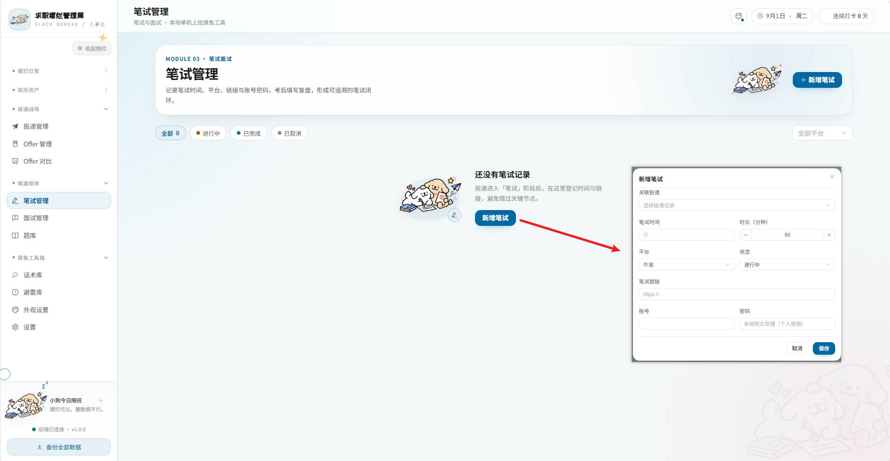
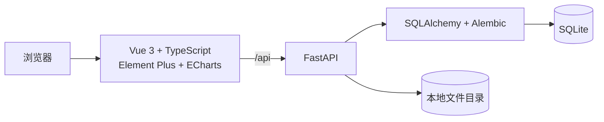

# 求职摆烂管理局

> 投递可以摆烂，过程不能失踪。一个本地运行、数据留在自己电脑上的个人求职全流程管理工具。


「求职摆烂管理局」是一款面向个人使用的本地 Web 软件，把分散在 Excel、备忘录、文件夹和聊天记录里的求职信息收拢到一个地方：

**简历资产 → 投递跟踪 → 笔试复盘 → 面试记录 → Offer 对比 → 数据分析**

它不需要账号系统，也不会主动把数据上传到云端。业务数据、简历、素材、证书和录音默认都保存在本机。


## 功能亮点

- **今日看板**：聚合待投递、待复盘、待刷题和自定义任务，记录连续打卡。
- **简历与素材资产**：按岗位维护多个简历版本，记录修改日志，归档项目素材、作品、证书和成绩单。
- **投递全流程管理**：支持公司/岗位/城市/备注搜索，状态、渠道、岗位类型和投递时间筛选，支持排序与分页。
- **状态时间线**：记录每次投递状态变化以及结束原因，完整保留求职过程。
- **笔试与面试复盘**：保存时间、链接、账号、准备清单、真实问答、面试结果和录音。
- **个人题库与话术库**：沉淀手撕代码、八股、项目反问和常用面试话术。
- **Offer 管理与对比**：折算年薪，按薪资、城市、工作强度、行业前景等权重评分，并通过雷达图辅助决策。
- **数据看板**：查看投递量、简历淘汰率、笔试通过率、面试率、Offer 率及岗位方向转化情况。
- **避雷库**：记录公司问题，新增投递时自动提示命中信息。
- **个性化外观**：多套主题与配色、背景壁纸、侧边栏收起和响应式布局。
- **完整备份恢复**：一键导出包含数据库与上传文件的 ZIP；恢复前自动创建本地快照。

## 界面预览

| 数据看板 | 简历资产 |
| :---: | :---: |
|  |  |

| 投递与 Offer 管理 | 笔试管理 |
| :---: | :---: |
|  |  |

| 面试管理 | 多主题风格 |
| :---: | :---: |
|  |  |

## 快速开始

### 环境要求

- Python 3.10+，推荐 Python 3.12
- Node.js 18+，推荐 Node.js 20 LTS
- npm
- 可选：LibreOffice，用于在应用内将 Word 简历转换为 PDF 预览

### 1. 启动后端

项目当前使用的 Python 环境是 `D:\Anaconda\envs\agent\python.exe`：

```powershell
cd backend
D:\Anaconda\envs\agent\python.exe -m pip install -r requirements.txt
D:\Anaconda\envs\agent\python.exe -m uvicorn app.main:app --reload --host 127.0.0.1 --port 8000
```

如果已经激活了自己的 Python 或 Conda 环境，也可以使用通用命令：

```bash
cd backend
python -m pip install -r requirements.txt
python -m uvicorn app.main:app --reload --host 127.0.0.1 --port 8000
```

后端启动时会自动创建数据目录、执行数据库迁移并写入必要的初始数据。

- API 文档：<http://127.0.0.1:8000/docs>
- 健康检查：<http://127.0.0.1:8000/api/health>

### 2. 启动前端

另开一个终端：

```bash
cd fronted
npm install
npm run dev
```

浏览器打开：<http://127.0.0.1:5173>

> 项目目录当前使用 `fronted` 这个名称，执行命令时请不要写成 `frontend`。

## 数据存储与备份

默认运行时数据位于：

```text
backend/data/
├── app.db          # SQLite 数据库
├── files/          # 简历、素材、证书、录音和预览缓存
└── backups/        # 恢复前自动快照等本地备份
```

如果希望把数据放到其他磁盘，可以在启动后端前设置 `QIUZHAO_DATA_DIR`：

```powershell
$env:QIUZHAO_DATA_DIR = "D:\qiuzhao-data"
D:\Anaconda\envs\agent\python.exe -m uvicorn app.main:app --reload --host 127.0.0.1 --port 8000
```

设置页支持：

- 导出完整 ZIP 备份，包含业务数据与上传文件；
- 导入完整 ZIP 或兼容旧版 JSON 备份；
- 恢复前自动保存当前数据快照，降低误覆盖风险。

## 技术架构



### 前端

- Vue 3、TypeScript、Vite
- Element Plus
- Pinia、Vue Router、Axios
- ECharts

### 后端

- FastAPI、Pydantic
- SQLAlchemy 2、Alembic
- SQLite
- 本地文件存储

## 项目结构

```text
m-offer-help/
├── backend/              # FastAPI 后端、数据库迁移与测试
│   ├── app/
│   ├── alembic/
│   └── tests/
├── fronted/              # Vue 3 前端
│   └── src/
├── docs/                 # PRD、架构、数据库和 API 设计文档
├── images/               # README 界面截图
└── README.md
```

## 开发与检查

前端：

```bash
cd fronted
npm run typecheck
npm run build
```

后端：

```powershell
cd backend
D:\Anaconda\envs\agent\python.exe -m pytest -q
```

## 本地使用说明

- 这是单用户本地软件，没有登录和多用户权限系统。
- 后端默认仅接受本机地址和受信任的本机前端来源访问，请不要将服务直接暴露到公网。
- 笔试账号、密码等字段按个人本地使用场景保存，界面默认遮蔽，但数据库中并非加密保险箱。
- Word 简历预览依赖 LibreOffice；未安装时仍可下载原文件查看。

## 设计文档

- [产品需求文档](./docs/PRD.md)
- [技术架构与设计](./docs/技术架构与设计.md)
- [数据库设计](./docs/数据库设计.md)
- [API 接口契约](./docs/API接口契约.md)
- [开发计划与里程碑](./docs/开发计划与里程碑.md)

---

愿每一条投递都有回音，每一次被拷打都有复盘，每一个 Offer 都来得不小心一点。
